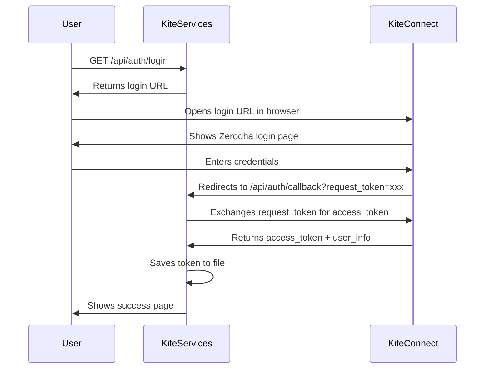

# Kite Connect Authentication Setup

## 🔐 **Complete Authentication Solution**

I've created a complete Kite Connect authentication system for your consolidated API. Here's everything you need to get fresh access tokens and start using real data.

---

## 🎯 **Callback URL for Kite Connect App**

### **Development (Local):**

```
http://localhost:8079/api/auth/callback
```

### **Production:**

```
https://your-domain.com/api/auth/callback
```

**⚠️ Important:** Set this exact URL in your Kite Connect app settings at [developers.kite.trade](https://developers.kite.trade/)

---

## 🚀 **Quick Setup Steps**

### **1. Configure Kite Connect App**

1. Go to [Kite Connect Developer Portal](https://developers.kite.trade/)
2. Login with your Zerodha account
3. Create new app or edit existing app
4. Set **Redirect URL** to: `http://localhost:8079/api/auth/callback`
5. Note your **API Key** and **API Secret**

### **2. Set Environment Variables**

Create `.env` file in project root:

```bash
KITE_API_KEY=your_api_key_here
KITE_API_SECRET=your_api_secret_here
SERVICE_PORT=8079
```

### **3. Install Dependencies**

```bash
cd /Users/ashokkumar/Desktop/ashok-personal/stocks/kite-services
source venv/bin/activate
pip install kiteconnect fastapi uvicorn pydantic pydantic-settings
```

### **4. Run Authentication Setup**

```bash
python setup_kite_auth.py
```

This will:

- Check your environment setup
- Provide login URL
- Open browser for authentication
- Verify token after callback

---

## 📡 **Authentication Endpoints**

### **Check Authentication Status**

```bash
GET http://localhost:8079/api/auth/status
```

**Response:**

```json
{
  "authenticated": false,
  "token_exists": false,
  "token_valid": false,
  "login_url": "https://kite.trade/connect/login?api_key=your_key&v=3",
  "message": "❌ Not authenticated. Please use the login URL to authenticate."
}
```

### **Get Login URL**

```bash
GET http://localhost:8079/api/auth/login
```

**Response:**

```json
{
  "login_url": "https://kite.trade/connect/login?api_key=your_key&v=3",
  "instructions": "1. Click the login URL to authenticate..."
}
```

### **OAuth Callback** (Automatic)

```bash
GET http://localhost:8079/api/auth/callback?request_token=xxx&action=login&status=success
```

This endpoint:

- Receives the request token from Kite Connect
- Generates access token automatically
- Saves token to `access_token.json`
- Shows success page with user info

### **Logout**

```bash
POST http://localhost:8079/api/auth/logout
```

Clears stored access token.

---

## 🔄 **Authentication Flow**



---

## 🎯 **Test Your Setup**

### **1. Start the Service**

```bash
python src/main.py
```

**Expected Output:**

```
🚀 Starting Kite Services on 0.0.0.0:8079
✅ Service manager initialized
🎯 Kite Services started successfully on port 8079
```

### **2. Check Authentication**

```bash
curl "http://localhost:8079/api/auth/status"
```

### **3. Get Login URL (if not authenticated)**

```bash
curl "http://localhost:8079/api/auth/login"
```

### **4. After Authentication, Test Market Data**

```bash
# Test with real Kite Connect data
curl "http://localhost:8079/api/market/data?symbols=RELIANCE&scope=basic"
```

**Expected Response:**

```json
{
  "request_id": "real_md_1642509000",
  "timestamp": "2025-01-18T10:30:00",
  "scope": "basic",
  "stocks": {
    "RELIANCE": {
      "symbol": "RELIANCE",
      "last_price": 2450.50,
      "change": 25.30,
      "change_percent": 1.04,
      "volume": 1250000,
      "market_status": "open"
    }
  },
  "total_symbols": 1,
  "successful_symbols": 1,
  "failed_symbols": []
}
```

---

## 🔧 **Troubleshooting**

### **Common Issues:**

#### **1. "Callback URL mismatch"**

- **Solution:** Ensure callback URL in Kite app exactly matches: `http://localhost:8079/api/auth/callback`
- **Check:** No trailing slashes, correct port (8079)

#### **2. "Invalid API credentials"**

- **Solution:** Verify `KITE_API_KEY` and `KITE_API_SECRET` in `.env` file
- **Check:** Copy exactly from Kite Connect app dashboard

#### **3. "Token expired"**

- **Solution:** Kite tokens expire daily, re-authenticate using login URL
- **Check:** `GET /api/auth/status` shows expiration time

#### **4. "Service not responding"**

- **Solution:** Ensure service is running on port 8079
- **Check:** `curl http://localhost:8079/health`

#### **5. "Dependencies missing"**

- **Solution:** Install required packages:

  ```bash
  pip install kiteconnect fastapi uvicorn pydantic pydantic-settings
  ```

### **Debug Steps:**

1. **Check logs:** `tail -f logs/kite_services.log`
2. **Verify environment:** `python setup_kite_auth.py`
3. **Test connectivity:** `curl http://localhost:8079/api/auth/status`
4. **Check token file:** `cat access_token.json` (if exists)

---

## 📚 **API Documentation**

Once authenticated, access:

- **Interactive API Docs:** <http://localhost:8079/docs>
- **Setup Instructions:** <http://localhost:8079/api/auth/setup-instructions>
- **Authentication Status:** <http://localhost:8079/api/auth/status>

---

## 🎉 **What Happens After Authentication**

Once you complete the OAuth flow:

1. **✅ Access Token Saved** - Stored in `access_token.json` with user info
2. **✅ Real Data Available** - All market endpoints now use live Kite Connect data
3. **✅ Automatic Token Usage** - No need to manually handle tokens
4. **✅ Daily Expiration** - Token expires at end of trading day
5. **✅ Easy Re-authentication** - Just visit the login URL again

### **Your Consolidated API Now Works With Real Data:**

```bash
# Universal market data with real prices
curl "http://localhost:8079/api/market/data?symbols=RELIANCE,TCS&scope=comprehensive"

# Portfolio with real P&L
curl "http://localhost:8079/api/market/portfolio?symbols=RELIANCE,TCS&quantities=100,50&avg_prices=2400,3800"

# Market context with live indices
curl "http://localhost:8079/api/market/context"
```

**Perfect!** Your consolidated API now provides real market data while maintaining the simplified 4-endpoint design! 🚀

---

## 🔗 **Quick Links**

- **🔐 Check Auth Status:** <http://localhost:8079/api/auth/status>
- **🔗 Get Login URL:** <http://localhost:8079/api/auth/login>  
- **📋 Setup Guide:** <http://localhost:8079/api/auth/setup-instructions>
- **📚 API Docs:** <http://localhost:8079/docs>
- **🏥 Service Health:** <http://localhost:8079/health>

**Your callback URL is ready to use:** `http://localhost:8079/api/auth/callback` ✅
